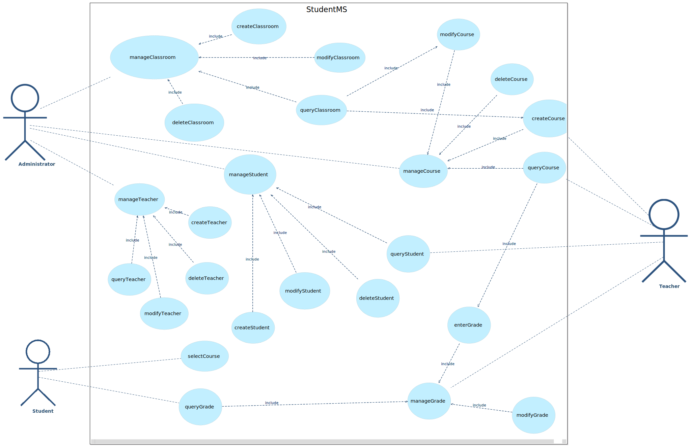
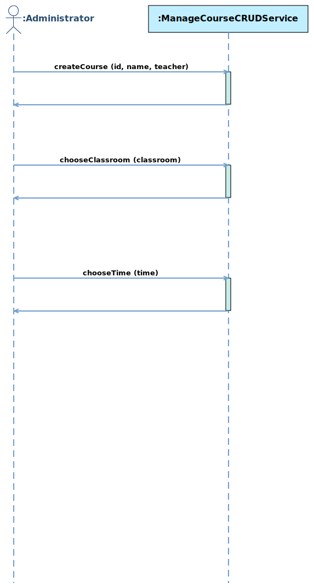
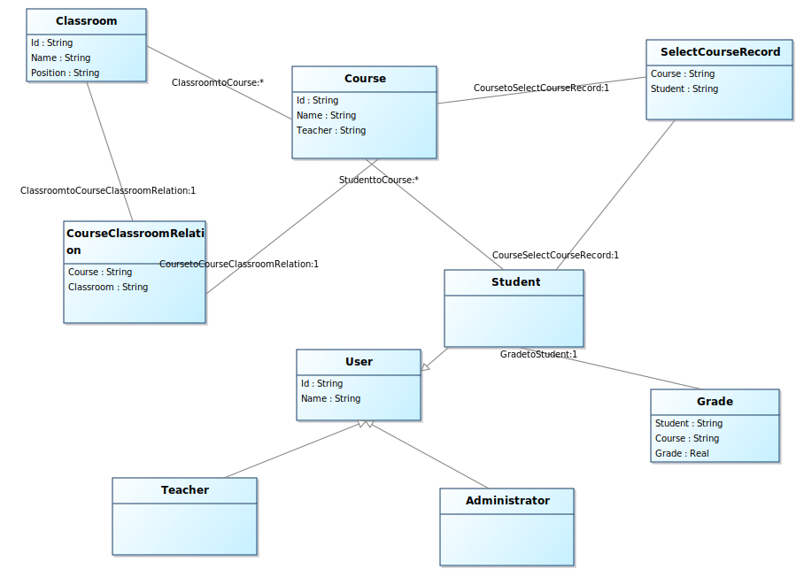
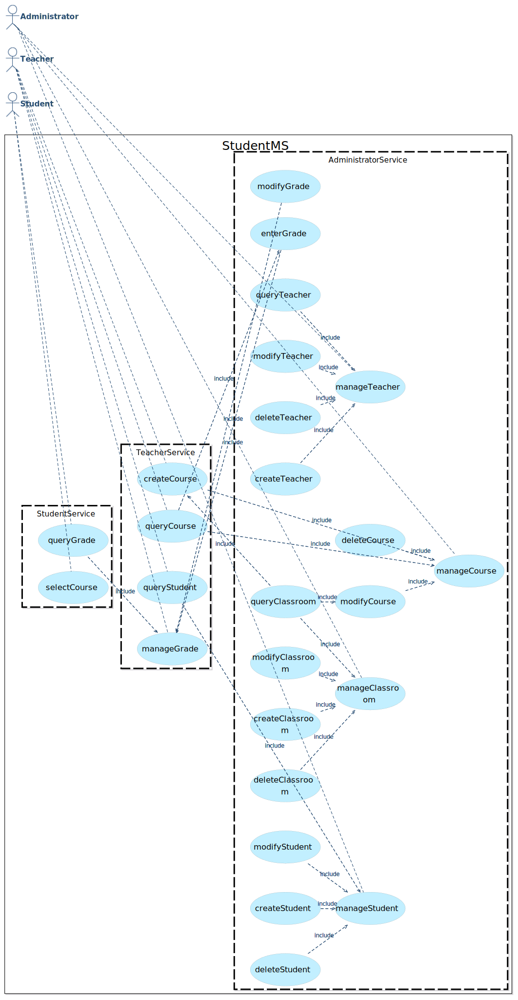
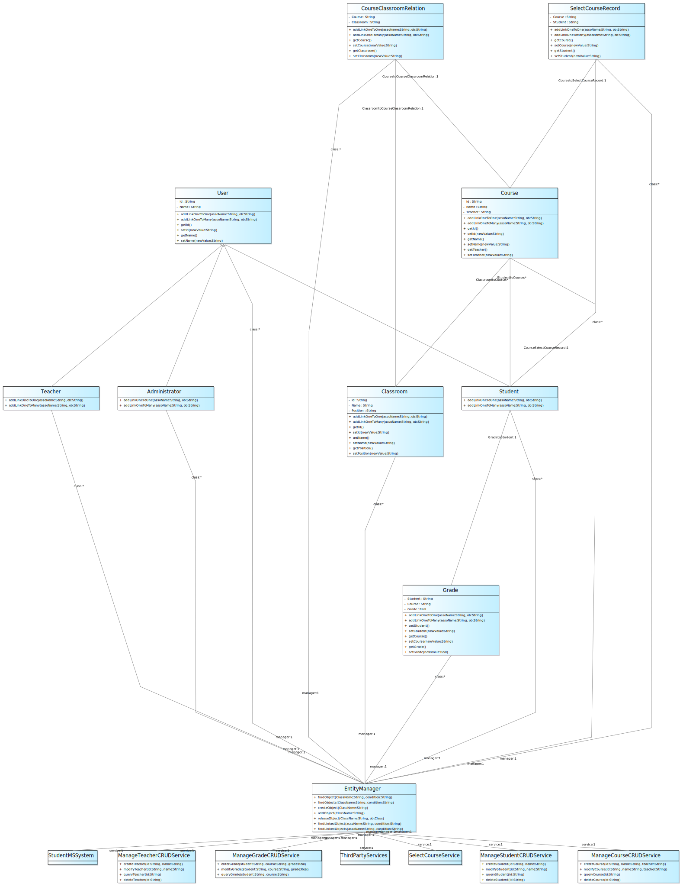

# 学生选课管理系统

## 项目简介

本系统为多角色协同的数字化**选课平台**，涵盖**学生、教师**与**超级管理员**三类用户，实现课程管理全流程智能化运作。

* 学生端支持实时查询课程库信息，可依据学分要求、时间安排进行**课程筛选**，在选课周期内完成选课/退课操作，系统自动检测时间冲突与容量限制。课程数据库支持**多维检索**（课程代码/教师/学分类型），实时显示选课人数余量，选课结果生成后自动同步至师生课表。
* 教师拥有独立管理界面，可创建新的课程（含**上课时间、上课地点**等），**成绩录入**模块设有校验机制，确保录入数值准确有效。
* 超级管理员具备全局管控能力，负责用户账号管理（**权限分配**）、系统参数设置（选课时间窗、学分上限等）及数据备份。

主要实体类包含：

* 学生
* 教室
* 教师
* 课程
* 超级管理员
* 成绩

## 实验1

### 1、模型需求规模

* 自然语言需求数量
  * 用户需求数量：34
  * 系统需求数量：25
  * 系统合约数量：13
  * 系统操作总数：18

* 用例图
  * Actor数量：3
  * 用例数量：25

* 系统顺序图
  * 系统顺序图数量：16
* 类图
  * 类数量：17

### 1、用例图

### 2、系统顺序图

创建一门课程的SSD

1. 选择课程ID、课程名称、授课教师
2. 选择教室地点
3. 选择上课时间

### 3、概念类图

## 实验2

### 1、系统架构图

#### 1.1

#### 1.2

### 2、类图

